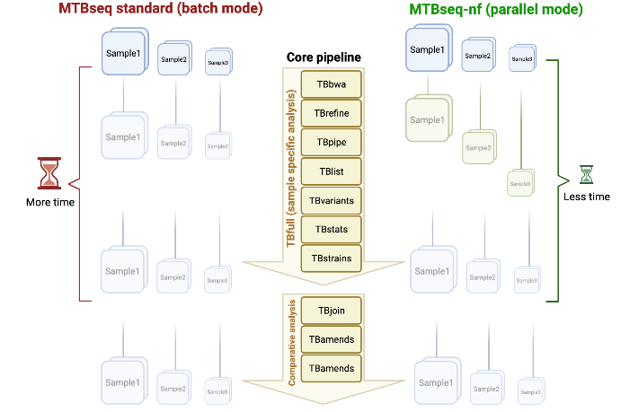

# MTBseq-nf

`MTBseq-nf` pipeline makes [MTBseq](https://github.com/ngs-fzb/MTBseq_source) simple and easy to use via [Nextflow](https://www.nextflow.io/) workflow manager.

# Benefits of the Nextflow wrapper

- Ability to analyze genomes in **parallel** in addition to the default execution mode.
- Fine-grain control over resource (CPU/Memory/Storage) allocation
- Use of bioconda and biocontainers for installing packages for reproducibility
- Ease of use on a range of infrastructure
  - Local machine - A strong server/laptop
  - Cloud - Azure / AWS
  - On-prem clusters - SLURM / PBS
- Resumability for failed processes
- Centralized locations for specifying
  - MTBseq parameters (`default_params.config`)
  - Hardware requirements (`conf/standard.config`)
  - Software requirements (`conf/docker.config` or `conf/conda.config`)
- Dedicated user interface for all parameters for wider audience (`nextflow_schema.json`). This allows [Nextflow Tower](tower.nf/) to generate a launch form dynamically.
- Easier customizability for the pipeline, using explicit parameters (`default_params.config`).

# Parallel execution of MTBseq via MTBseq-nf

This pipeline add a new option for running MTBseq with paralellization using nextflow to control the resource utilization, as well optimizing the overall time to run it.

## Normal and Parallel workflows

This pipeline has two execution types: normal and parallel and here is a visual representation.

The execution type is determined by the presence of `parallel` parameter.

## What are the differences between `Normal` and `Parallel` analysis modes?

A normal MTBseq run would use `MTBseq --step full` and all samples would move to the next stage of the analysis in sync with each other, hence not allowing parallelization of analysis for samples which have been analyzed at a given step. Steps like `TB BWA` and `TB Variants` and leading to suboptimal usage of the available hardware.

Using `--parallel` run we enforce the parallelization of each step. The main advantage of it is the precise resource usage as the steps are controlled by Nextflow, and some steps require less CPUs and RAM than other, this allow us to optimize the run time and resource costs.

# Installation and Usage

For installation and usage please refer the dedicated [INSTALL](./docs/INSTALL.md) and [USAGE](./docs/USAGE.md) documents.

# Contributions

Contributions are warmly accepted!

# License

The inspiration for this project is [MTBseq](https://github.com/ngs-fzb/MTBseq_source) which is released under a GPL-3 license as of [v1.0.3](https://github.com/ngs-fzb/MTBseq_source/blob/v1.0.3/LICENSE.md).

The components related to `MTBseq-nf` project itself (the Nextflow wrapper code) are licensed under the liberal MPL-2.0 license.

We would like to thank the developers of MTBseq for putting in the initial effort!
