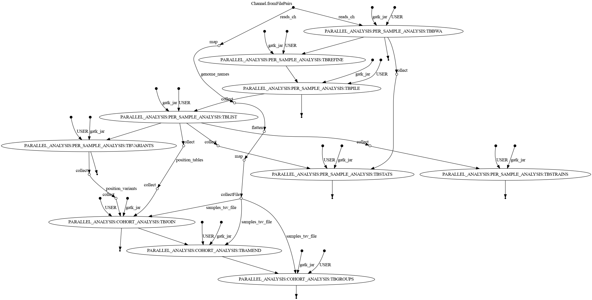

# mtbseq-nf

**NOTE: This still a work in progress, the code is functional however the [usage](#Usage) doc needs some love!**

[MTBseq](https://github.com/ngs-fzb/MTBseq_source) made simple and easy using [Nextflow](https://www.nextflow.io/) workflow manager. 

# Benefits of the Nextflow wrapper

- Fine-grained control over resource allocation (CPU/Memory/Storage)
- Reliance of bioconda and biocontainers for installing packages for reproducibility
- Ease of use on a range of infrastructure (cloud/on-prem clusters/local machine)
- Resumability for failed processes
- Centralized locations for specifying 
    - Hardware requirements (`conf/standard.config`)
    - Software requirements (`conf/docker.config` or `conf/conda.config`)
    - MTBseq parameters (`conf/global_parameters.config`)
- Dedicated user interface for all parameters for wider audience (`nextflow_schema.json`)
- Explicit rather than the implicit options (`conf/global_parameters.config`)
- Ability to analyze genomes in **parallel** as well as in **batch** 

# Workflow example
This pipeline has two execution types: batch and parallel and here is a dag example for them!

The execution type is determined by the analysis\_mode parameter

## Batch

## Parallel

# Usage 

## Nextflow command line

## Nextflow Tower 

# Contributions

Contributions are warmly accepted!

# License

The insipiration for this project itself [MTBseq](https://github.com/ngs-fzb/MTBseq_source) has a GPL-3 license as of [v1.0.3](https://github.com/ngs-fzb/MTBseq_source/blob/v1.0.3/LICENSE.md).

The components related to `mtbseq-nf` project itself (the Nextflow wrapper code) are licensed under the liberal MPL-2.0 license.

We would like to Thank the developers of MTBseq for putting in the intial effort!

