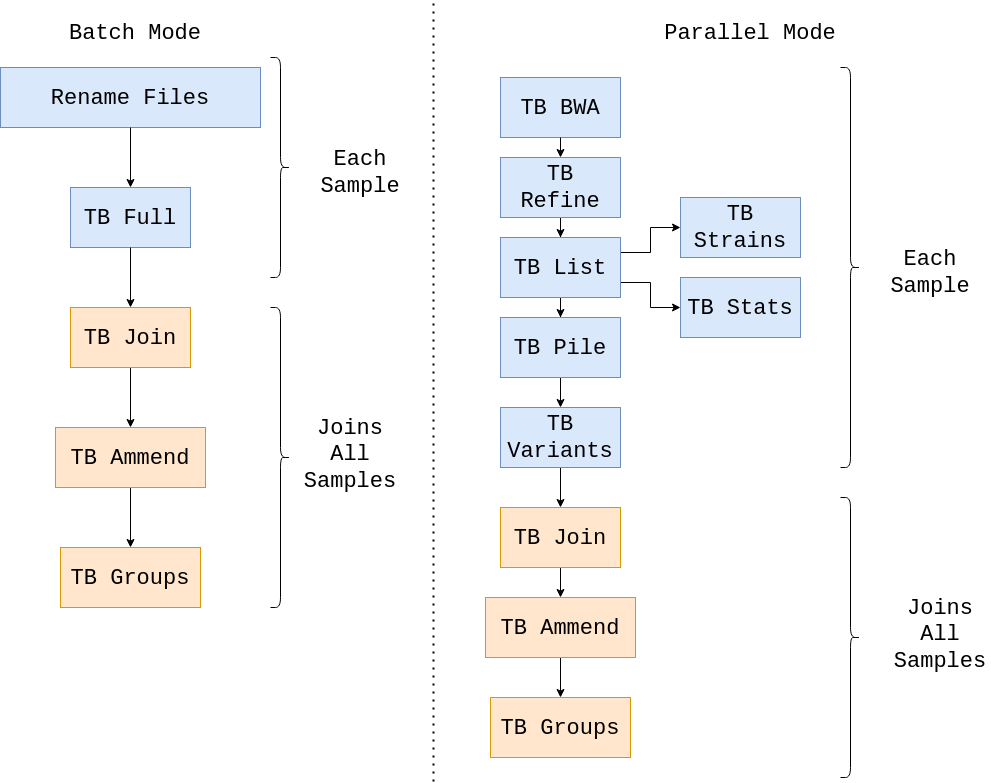

# mtbseq-nf

`mtbseq-nf` pipeline makes [MTBseq](https://github.com/ngs-fzb/MTBseq_source) simple and easy to use via [Nextflow](https://www.nextflow.io/) workflow manager. 

# Benefits of the Nextflow wrapper

- Fine-grained control over resource allocation (CPU/Memory/Storage)
- Reliance of bioconda and biocontainers for installing packages for reproducibility
- Ease of use on a range of infrastructure (cloud/on-prem clusters/local machine)
- Resumability for failed processes
- Centralized locations for specifying 
    - MTBseq parameters (`conf/global_parameters.config`)
    - Hardware requirements (`conf/standard.config`)
    - Software requirements (`conf/docker.config` or `conf/conda.config`)
- Dedicated user interface for all parameters for wider audience (`nextflow_schema.json`). This only works on [Nextflow Tower](tower.nf/).
- Easier customizability for the pipeline, using explicit parameters (`conf/global_parameters.config`).
- Ability to analyze genomes in **parallel** as well as in **batch**, on `local`, `cloud` and `cluster` environments.

# Usage

The simplest use case is to analyze a few genomes on a local environment. Almost all aspects are customizable but for the sake of brevity, a bare bones guide for any beginner user is as shown below

- [ ] 1. Clone the project 

```shell
git clone https://github.com/mtb-bioinformatics/mtbseq-nf
cd mtbseq-nf
```

- [ ] 2. Download the  `gatk-3.8.0` tar from [here](https://console.cloud.google.com/storage/browser/_details/gatk-software/package-archive/gatk/GenomeAnalysisTK-3.8-0-ge9d806836.tar.bz2;tab=live_object)

- [ ] 3. Untar it and place it in the `resources` folder

```
tar -xvf GATK_TAR_FILE
```

- [ ] 4. Move your genomes to the `data/full_data` folder

They should follow the pattern `SAMPLE_R1.fastq.gz` and `SAMPLE_R2.fastq.gz`

OBS: Please don't use the `_` character on sample names. (ie.: Don't use `sample_001_R1.fastq.gz`, `sample001_R1.fastq.gz` would be better)

- [ ] 5 If you don't already have `nextflow` installed, you can use the following commands to install it 
```
 curl -s https://get.nextflow.io | bash
```

- [ ] 6. To run the pipeline, make sure you have `conda` or `docker` installed. 

  - [ ] 6.1 If you're using conda:

  ```shell
  conda create -n mtbseq-nf-env -c bioconda -c conda-forge nextflow 
  ```

  You can confirm the setup by activating that environment and using the `nextflow info`  command

  ```
  conda activate -n mtbseq-nf-env

  nextflow info 
  ```

- [ ] 7 Simply issue the following command on the command line

```
nextflow run main.nf -profile standard,{docker,conda} --analysis_mode {parallel,batch}
```
Chosing `docker` or `conda`, and `parallel` or `batch` 

  - [ ] 7.1 Runing with conda on parallel mode

  ```
  nextflow run main.nf -profile standard,conda --analysis_mode parallel
  ```

  - [ ] 7.2 Runing with conda on batch mode

  ```
  nextflow run main.nf -profile standard,conda --analysis_mode batch
  ```  

  - [ ] 7.3 Runing with docker on parallel mode

  ```
  nextflow run main.nf -profile standard,docker --analysis_mode parallel
  ```

  - [ ] 7.4 Runing with docker on batch mode
  
  ```
  nextflow run main.nf -profile standard,docker --analysis_mode batch
  ```

# Workflow example

This pipeline has two execution types: batch and parallel and here is a dag example for them!

The execution type is determined by the `analysis_mode` parameter

## Batch and Parallel workflows


### What are the differences between `Batch` and `Parallel` analysis modes?

Batch uses `MTBseq --step full` on each sample, not allowing parallelization of secondary steps like `TB BWA` and `TB Variants`,
Parallel enforces the parallelization of each step. The main advantage of Parallel is the precise resource usage, as some steps
require less CPUs and RAM than other, this allow us to parallelize the steps and optimize the run time.

# Contributions

Contributions are warmly accepted!


# License


The insipiration for this project itself [MTBseq](https://github.com/ngs-fzb/MTBseq_source) has a GPL-3 license as of [v1.0.3](https://github.com/ngs-fzb/MTBseq_source/blob/v1.0.3/LICENSE.md).

The components related to `mtbseq-nf` project itself (the Nextflow wrapper code) are licensed under the liberal MPL-2.0 license.

We would like to Thank the developers of MTBseq for putting in the intial effort!

